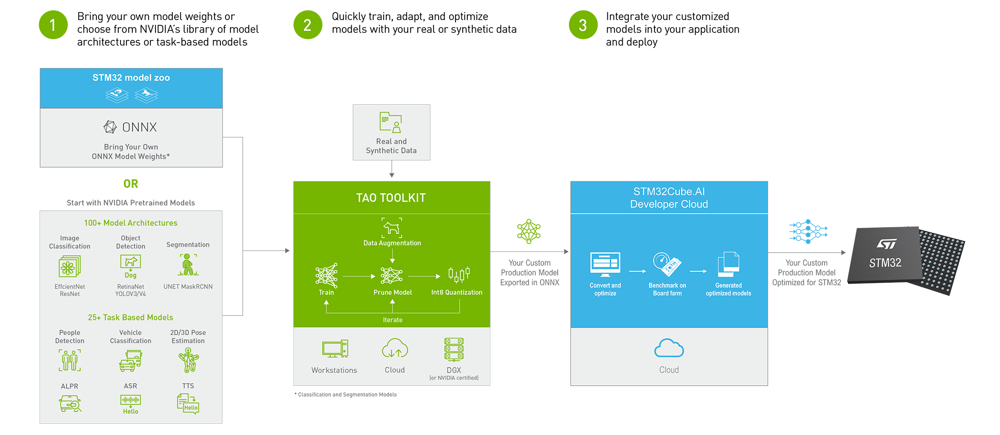

# STM32AI – TAO

Welcome to STM32AI - TAO!

This repository provides a collection of example scripts that can be used to Train, Adapt and Optimize for given use cases and then easily pass the resulting AI models through STM32Cube.AI to deploy them on your STM32 boards.

These scripts provide a complete life cycle of the model training, optimization and benchmarking using [NVIDIA TAO Toolkit](https://developer.nvidia.com/tao-toolkit) and [STM32Cube.AI Developer Cloud](https://stm32ai.st.com/stm32-cube-ai-dc/).

NVIDIA Train Adapt Optimize (TAO) Toolkit is a simple and easy-to-use Python based AI toolkit for taking purpose-built AI models and customizing them with users' own data.

[STM32Cube.AI Developer Cloud](https://stm32ai-cs.st.com/home) is a free-of-charge online platform and services allowing the creation, optimization, benchmarking, and generation of AI models for the STM32 microcontrollers. It is based on the [STM32Cube.AI](https://stm32ai.st.com/stm32-cube-ai/) core technology.

Bring Your Own Model (BYOM) is a Python based package that converts any open source ONNX model to TAO compatible model. All you need is to export any model from a deep learning framework of your choice (e.g. PyTorch) to ONNX and run TAO BYOM converter.

With the Jupyter notebooks, you will learn how to leverage the simplicity and convenience of TAO to take a pretrained model, finetune it on a sample dataset and then:
- Prune the finetuned model,
- Retrain the pruned model to recover lost accuracy,
- Export the pruned model as an onnx model,
- Quantize the model using onnxruntime,
- Run Benchmarking of the quantized onnx model (finetuned, pruned, retrained, and quantized) using STM32Cube.AI Developer Cloud to know the footprints and embeddability of the models.
At the end, you will have generated a trained and optimized classification model which was imported from outside TAO Toolkit, and that may be deployed via STM32Cube.AI Developer Cloud.

<br>



<br>

[LICENSE](./LICENSE.md) : 

This software component is licensed by ST under BSD-3-Clause license, the "License";

You may not use this file except in compliance with the License.

You may obtain a copy of the License at: https://opensource.org/licenses/BSD-3-Clause

Copyright (c) 2023 STMicroelectronics. All rights reserved.

Copyright (c) 2023 NVIDIA. All rights reserved.

<br>

This project contains two folders:
- **[byom_converters](./classification_tf2/byom_converters/)** : contains Jupyter Notebooks to convert the PyTorch models to .tltb files (a proprietary template from NVIDIA for BYOM (bring your own model))
- **[byom_person](./classification_tf2/byom_person/)** : contains Jupyter Notebooks to train the BYOM models generated using byom_converters for person-detection use case as well as the configurations for running these files in folders:
   - [specs_mobilenetv2](./classification_tf2/byom_person/specs_mobilenetv2/), and 
   - [specs_resnet18](./classification_tf2/byom_person/specs_resnet18/).
- **[tao_person](./classification_tf2/tao_person/)** : contains a jupyter notebook `stm32ai_tao_efficientnet_b0.ipynb` to fine-tune the pretrained `efficientnet_b0` model obtained from NGC model zoo, for person-detection use case as well as the configurations for running this file in folder [specs](./classification_tf2/tao_person/specs/).
- **[LICENSE.md](./LICENSE.md)**
- **[SECURITY.md](./SECURITY.md)**
- **[CODE_OF_CONDUCT.md](./CODE_OF_CONDUCT.md)**
- **[CONTRIBUTING.md](./CONTRIBUTING.md)**

## Before you start

- Create an account on myST and then sign in to [STM32Cube.AI Developer Cloud](https://stm32ai-cs.st.com/home) to be able access the service.
- If you don't have python already installed, you can download and install it from [here](https://www.python.org/downloads/), a **3.6 <= Python Version <= 3.8** is required to be able to use NVIDIA TAO and the scripts provided here, we recommend to use **Python v3.8.16**. (For Windows systems make sure to check the **Add python.exe to PATH** option during the installation process).
- Install Jupyter server and notebook libraries to run the Jupyter notebooks.
- Clone this repository using the following command:
```
git clone https://github.com/STMicroelectronics/stm32ai-tao.git
```
- The delivery contains two types of notebooks
    - `byom_converter_***.ipynb`, and
    - `stm32ai_tao_***.ipynb`.
- The users need to create seperate Python environments using conda or pyenv to run these notebooks. The Python environments can be created using following commands named as `byom_dev` and `byom_launcher`:
```
cd stm32ai-tao
python -m venv <env-name>
```
- Activate your virtual environment, on Windows run:
 ```
<env-name>\Scripts\activate.bat
```
On Unix or MacOS, run:
 ```
source <env-name>/bin/activate
```

**NOTE**: The names of the environments are just a suggestion and users can choose whichever name they prefer.

## Running the Jupyter Notebooks
The running of Jupyter notebooks requires:
- activate the `byom_dev` environment for all the `byom_converter***.ipynb` notebooks to convert your onnx models to byom model (.tltb), and
- activate the `byom_launcher` environment for the `stm32ai_tao_***.ipynb` notebooks to train, adopt, optimize, benchmark and to convert your byom models in optimized c code for STM32 projects.
  - an internet connection is needed to run some cells of the notebooks
    - to download the dataset,
    - to get the models from torch.hub, and
    - to connect to STM32Cube.AI developer cloud.